# Github Instruction Project

This repository is created to demonstrate the github features to students learning Information Technology and Software Engineering courses in RMIT.

The Brief Instruction section shows the command to 
**clone**, 
**upload** modified file, 
and **download** the most recent update. 
Further details of each feature above will be demonstrated 
in the **Git Guideline** section.

**Table of Content**

[Create an Account](#creating-an-account)

[Brief Instruction](#brief-instruction)

[Conventional Practice](#conventional-practice)

[Git Guideline](#git-guideline)

## Creating an Account

Go to the [GitHub Home Page](https://github.com/)
and click the **Sign Up** button on the top right of the page.
Follow the registration steps to create a GitHub Account.

### Student Developer Pack

GitHub provides a special package named **Student Developer Pack**,
which provides **advanced features** that students can use with regular
renewal or for a limited number of credits.
You can use an **existing GitHub account**
to **register** for the **Student Developer Pack**
by clicking on the link below:

https://education.github.com/pack

Click the **Sign Up for Student Developer Pack** button,
and follow the procedure to register for an account:

1. Setup Billing Information
2. Setup Two-Factor Authentication
3. Select or specify your **RMIT Email Address**
4. State how you plan to use GitHub to support your education
5. Press the **Continue** button and finish the rest of the process

## Brief Instruction

GitHub operations can be done in command line (like Git Bash), 
or a GUI application (like in IDEs such as IntelliJ, VS Code, or other Git GUI)

### Create a Repository

### GUI-based

This tutorial demonstrates how to **clone** a GitHub repository, 
**upload** modified files and 
**download** the up-to-date version 
using the IntelliJ IDEA 2023 Edition.

#### Cloning Project

Clicking the "<> Code" button on the repository home page shows the **repository_url**, as illustrated in the picture below.

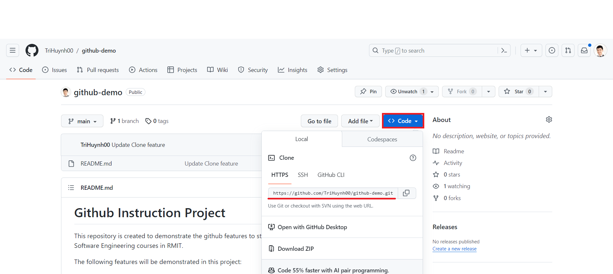

From the IntelliJ Hamburger button, open the Main Menu Hamburger Button (Hotkey Alt + \)
, then select File / New / Project from Version Control

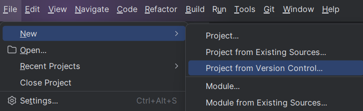

Select the **Repository URL** option and 
paste the HTTPS URL of the repository into the **URL** field. 
Select the target folder location in the local machine in the
**Directory** field and press **Clone**.

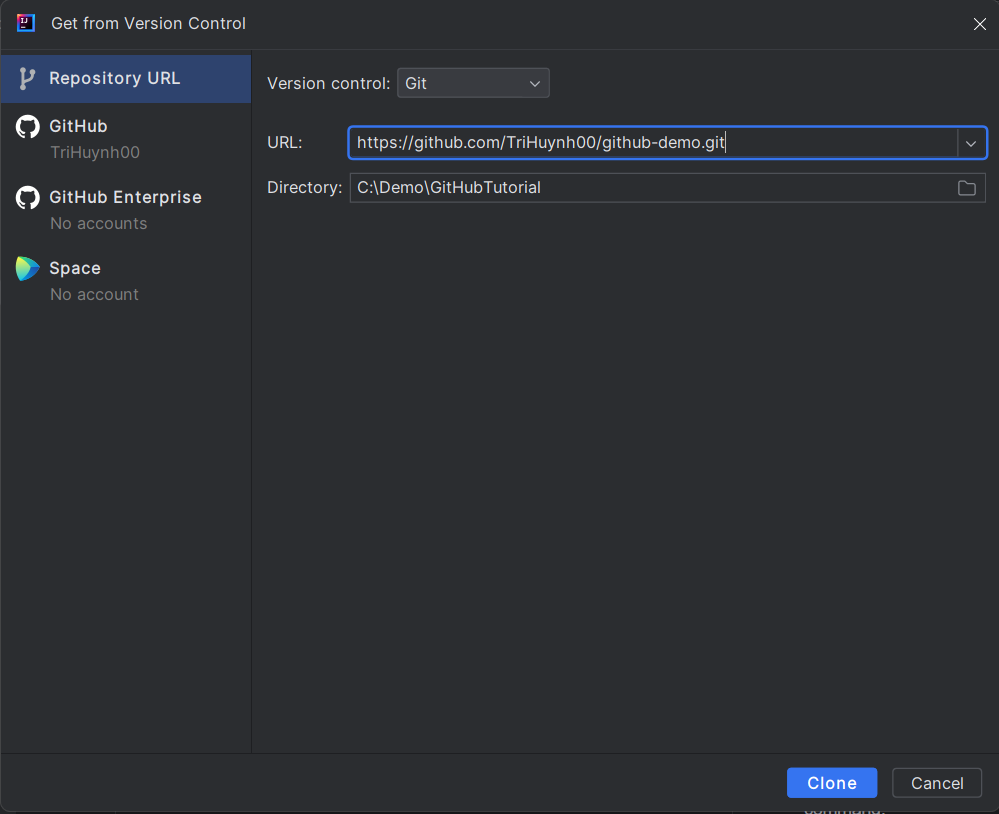

#### Upload Modified Files to the GitHub Repository on the Server

The next step is to select the modified files that we want to
upload to our **remote** repository in the GitHub server.

Click on the Commit button near the top left corner of the
IntelliJ IDE. We will see two lists of files: Changes and Unversioned Files.
The Changes show the modified files, while the Unversioned Files list the new or deleted files. Select the files or folders that you want to upload to the remote repository in the GitHub server.

Afterward, specify the commit message in the underneath text field. 
This message typically describes the task you accomplished, 
the reason for modifying the files or folders, 
and/or what to do next. 
Finally, press the **Commit and Push...** button if you are
ready to upload the changes to the remote repository. However,
if we just want to apply the change to our local repository only,
then select the **Commit** option.

The below example select the README and Main.java file to be committed.

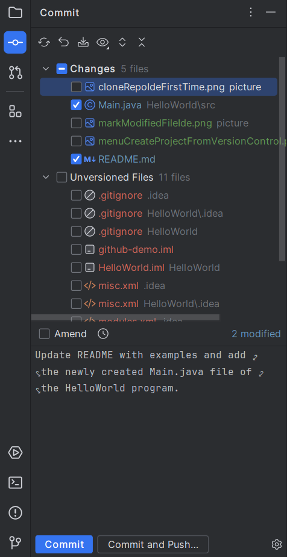

Pressing the **Commit and Push...** button shows a summary
of the changes that will be applied to the remote repository.
Pressing the **Push** button will upload and merge the changes
to the remote repository.

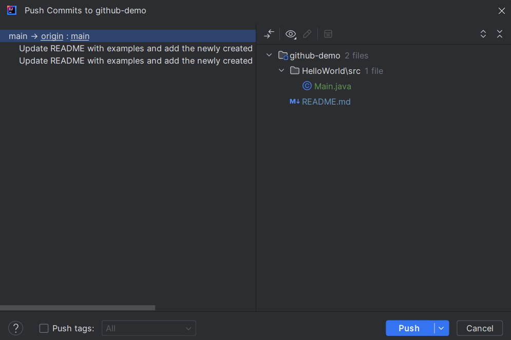

#### Download the Latest Version from the Remote Repository

To get the latest version into our local machine.
Select the Git option (Alt + 9) in the bottom left corner of the IDE,
a Directory Tree will appear. Right-click on the branch that you want
to download from the repository 
and select Pull into '<branchName>' to download the latest version of the branch.

The following example pulls the latest version of the main branch to the local repository.

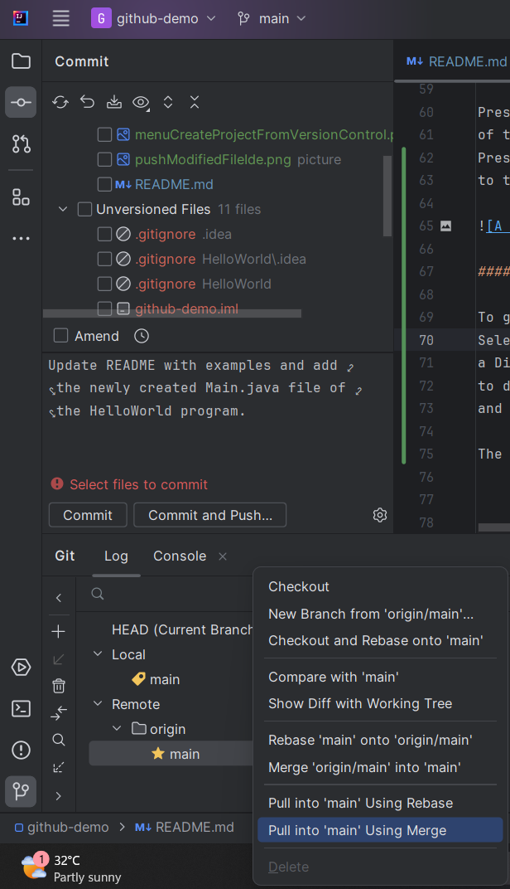

### Command Lines

One popular tool to use Git via a Command Line Interface (CLI) is
**Git Bash**. 
You can download Git Bash for your OS .

The common procedure of working with GitHub is as follows:

1. **Clone** the **repository** from a GitHub server to a local machine
> git clone yourRepositoryUrl

2. Make changes to *files* or _folders_ inside the repository. 
To prepare for **uploading** the selected _files_ or _folders_ to the GitHub server, 
use the **git add** command. We can add single or multiple files in one **add** command:

> git add fileName1 fileName2

> git add folder1 folder2

**Tip:** **Git only uploads modified file(s) in a folder** when we call **git add <folderName>**. 
Thus, we usually do not have to add each changed file into the **git add** command.

3. **Commit** the selected files or folders with a message to explain the file's modification.
> git commit -m "Explanation of Files or Folders Modification"

4. **Push** (Upload) the selected files or folders to the GitHub server. 
> git push

After pushing successfully, the GitHub server **updates** the changes to the repository 
if no conflict exists.

5. When we want to **download** the **up-to-date repository** 
after our teammates push their code, the command is:
> git pull

## Conventional Practice

1. **Pulling before Pushing**:
While working on your code, other teammates may have finished their 
development and pushed their code. 
Therefore, to ensure that the latest version in the repository 
is compatible with your implementation, we should **call git pull** to
check for any new snapshot, **rerun tests**, and **solve** any **conflicting** code 
**before pushing** our work.

2. **Descriptive Commit Message**: A commit message summarizes 
the implementation of its snapshot. Therefore, to help us and other 
team members understand why, how, and what our commit is created, 
the commit message should **briefly describe the implemented feature or fix**, 
any **unfinished tasks** or **known issues**, and the **next steps**.

3. **Commit Small and Tested Code Frequently**: 
To minimize the risks of creating complex bugs in a single commit 
of a completed requirement, continually pushing small and tested features
helps us to identify potential conflict or incompatible behavior with 
other application components easier because the scope and size of
the changes are manageable.

4. **Do Not Execute _git add_ on Executable Binaries and Libraries**: 
To decrease the remote repository's size and reduce upload and download 
time, we should not add binaries or libraries into the stating area. 
Another reason is that one can install the binaries and libraries on 
their PC. Thus, adding and pushing the files is unnecessary.

## Git Guideline

This section introduces the mechanism of frequently used Git commands. 
We refer to the **Brief Instruction** section above if you need a quick start on the project.

### Create and clone a repository

When you or your teammate creates a repository on the GitHub website, 
that repository exists in the GitHub server but not on our computer. 
We need to clone the repository into a folder to "download" the GitHub repository into a machine. 

#### Cloning using GitHub Credential

First, we need a folder to store the repository. 
Create a folder at the desired location in your computer. 
Next, clone the repository using the command below:

> clone http://**<repository_url>**

Clicking the "<> Code" button on the repository home page shows the **repository_url**, as illustrated in the picture below.

Cloning the HTTPS URL of the repo does not require any additional setup. 
The command to clone using the HTTPS URL is as follows:

> clone https://github.com/TriHuynh00/github-demo.git

### Add new changes to a repository

Adding new changes to Git does not simply overwrite the new file in the GitHub repository.
Git contains three main sections: 

1. **Working Directory:** The file structure of a version of the repository
2. **Staging Area:** The storage of files that will be merged into your project in the next commit
3. **.git Directory:** The metadata and objects of the repository.

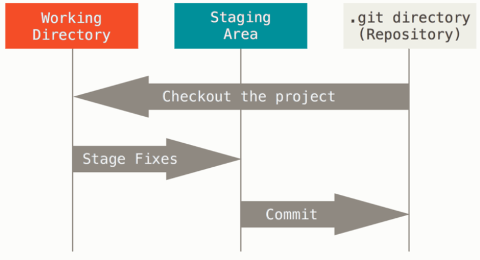

Any new or modified file must be placed in a Staging Area first.
Once the user commits the code, 
Git updates the files from the Staging Area to the .git Directory of the project repository.

The command to add files or folders into the Staging Area is:

> git add fileName1 fileName2 

> git add folderName1 folderName2 fileName1 fileName2

Additionally, the **git add** command has several options as follows:

1. **git add -u** : Stage modified and deleted files. NOT new files
2. **git add .**  : Recursively add the entire directory, including files start with dot
3. **git add -A** : Stage all modified, deleted, and new files

### Commit the Changes

A Commit creates a snapshot of our repository 
from the files in the Staging Area, 
i.e., a version of the project. 
As a result, a chain of commits shows the history of our repository.

In the command line interface, create a commit using the following command:

> git commit -m "Message"

In case we want to fix a mistake in the previous commit **message**,
using the **--amend** option let us modify the message 
without altering the snapshot, i.e., the files in the commit.

> git commit --amend -m "An updated Message" 

Modern IDE offers a convenient Commit GUI (Graphical User Interface) 
that presents the list of modified, deleted, or new files available for commit,
and a text field to input the commit message. 
The following screenshot shows an example of a Commit GUI in IntelliJ.

### Push the Change to the GitHub Repository

A Push command updates the committed snapshot to the remote repository in the GitHub server,
Since the push action shall be done by an authorized user,
Git requires the user credentials in every push. 
To avoid Git prompting credentials everytime we push the code,
one can configure Git to use the following mechanisms for automatic authorization.

#### Pushing using SSH

**Note:** If you are new to Git, we recommend trying the Personal Access Token
method in the next section.

One disadvantage of cloning the repository with HTTPS URL is that
users must give their credentials (username and password) for every push.
Another way to avoid this inconvenience is using the Secure Shell (SSH) key verification mechanism,
which requires users to configure their SSH key once during the entire GitHub session.
Therefore, we can push and pull code without being prompted for credentials.

First, we need to create an SSH key. If you are using Windows,
one option is to use Git Bash and create the SSH key as instructed
[here](https://docs.github.com/en/authentication/connecting-to-github-with-ssh/generating-a-new-ssh-key-and-adding-it-to-the-ssh-agent#generating-a-new-ssh-key).

To set the SSH Key, navigate to your avatar to the top right corner of the screen
and select Settings.

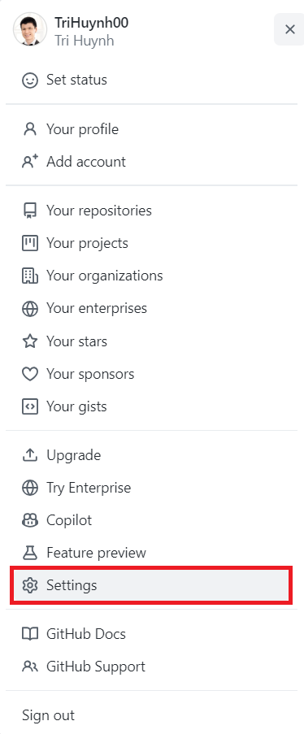

Choose the **SSH and GPG keys** option in the left menu panel. 
Then click on the **New SSH Key** button on the top right of the page.

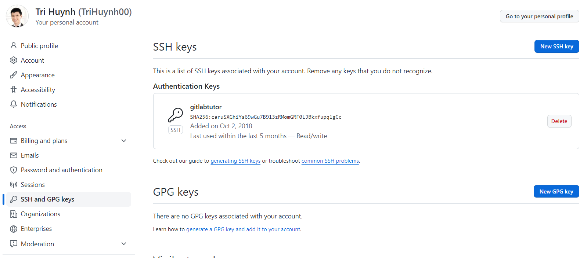

Set the title and copy the content of your newly create private key
into the **Key** field. A private key is the file **without** the .pub extension.

##### Using the Key in Command Line Interface (CLI)

One popular tool to use Git via a Command Line Interface (CLI) is
**Git Bash**.
You can download Git Bash for your OS .

Configure your key in Git Bash using the following command

> eval "$(ssh-agent -s)

> ssh-add /path/to/your/SSH/key/folder

Then you can use git commands as usual.

##### Configure the key in IDE

In IntelliJ, navigate to File / Settings. 
On the left panel, select Version Control / Subversion / SSH.
Then click on the **Private Key** radio button and 
select the path to your SSH Key file. 

#### Using Personal Access Token (Authtoken)

An Authtoken contains the user identity and granted privileges.
The Authtoken can also have an expiration period, 
which will deactivate the token after the expiry date.

In GitHub, one can create an Authtoken in the following steps:
1. Click on your avatar in the top right corner and choose "Settings"
2. On the left menu panel, select **Developer Settings**
3. On the left menu panel, select **Personal Access Tokens**
4. Choose **Token classics**
5. On the top right area of the page, click the **Generate new token** button and select **Generate new token (classic)**
6. Enter the Note, Expiration, and select the scopes.
For projects without Continuous Integration / Continuous Deployment feature,
all options in the **repo** scope and **user - user:email** are sufficient.

## Pull from the Repository (Download)

To get the latest version created by the push of our teammates 
in the remote repository. A **git pull** is required to merge
the latest snapshot with the one in our local machine.
 
> git pull

## Create feature branch in a repository
Source: https://blog.mergify.com/feature-branch-a-quick-walk-through-git-workflow/

The main idea in a feature branch workflow is that development for each feature happens independently instead of in the main branch. That makes it easier for developers to work on different features without hindering or interfering with the main trunk. It also allows continuous integration since broken code never enters the main branch.

A feature branch Git is usually a branch created off of the main branch. It is for developing a single feature or addressing a single issue

A feature branch is a type of branch in Git typically used to develop new features for the software. When a feature is ready for release, it is merged back into the main branch

In github, to create a new feature branch, we can follow these steps:

### From UI
1. Select "View All Branches"

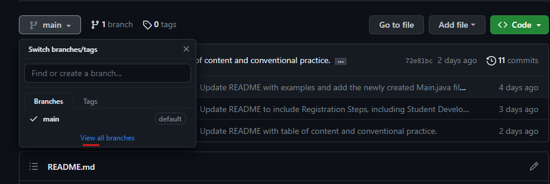

2. Select "New Branch" option

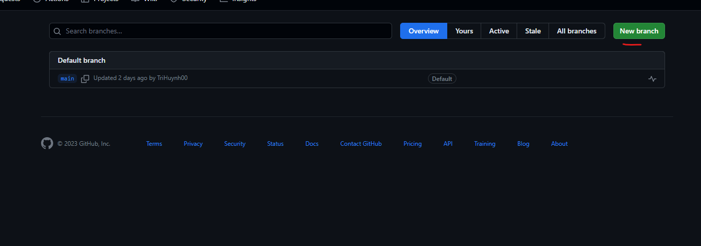

3. Create a new branch
Enter the branch name you want to create. Remember that the branch name needs to relate to the feature purpose or the ticket number you are working on (Jira ticket number). Example: login-function, hot-fix-unable-to-view-car-details, Meta-7763 (Meta is the project on Jira and 7763 is the ticket number).

Source value: the branch that will be created from. For example, we want to create a new feature branch from main branch (branch out), we will select the source value is main. In other cases, if we want to create a new feature branch from dev/develop/development branhc, we will select the source value is dev/develop/development.

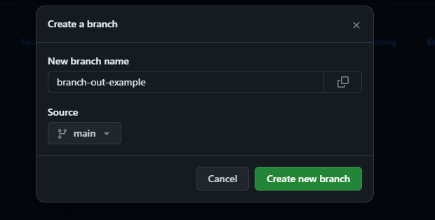

Go back to the main repo to see the new branch, you can swith the different branch to see the updated code/document. This step will be important for the pull request. 

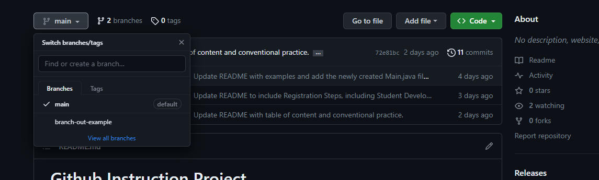

### From command
1. Select the current branch that you are working on. To see/view the current branch you are currently working on, you need to navigate to the directory (containing .git folder) and run this command

git branch

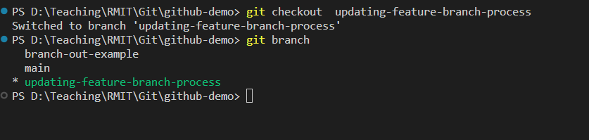

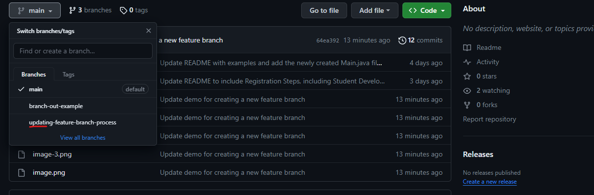

2. As you can see from the attached image, we are on the main branch. In this case, if you want to create a new branch from the main branch you can run the following command

git checkout -b <branch-name> 

E.g git checkout -b updating-feature-branch-process

To verify that you navigate to the new branch, you can type git branch

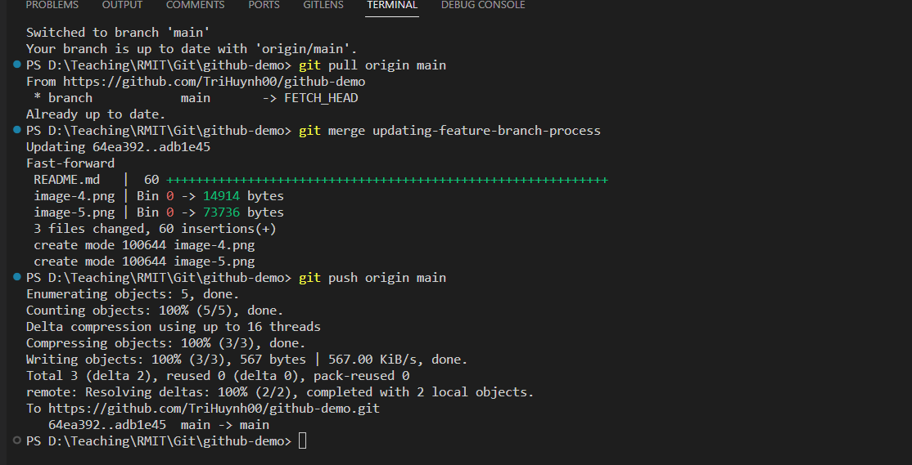

3. Remember, when we work in the team, you cannot see other branches (that others created before). You need to run the following command to fetch and navigate to these branches.

For example:
We don't see the new branch branch-out-example. 

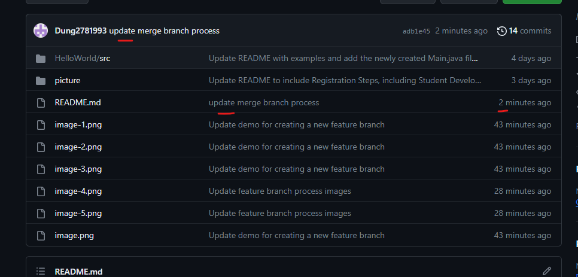

We need to run git fetch and git checkout branch-out-example to bring that branch into our local device.

4. We can switch between different branch by following this command

git checkout <branch-name>

E.g git checkout  updating-feature-branch-process   

5. Finally, we need to push the new branch to the github (remote repo), we can run the following command

git push --set-upstream origin <branch-name>

E.g
git push --set-upstream origin updating-feature-branch-process

It may ask your username/password to login into git to perform the push action. Verify the new branch on the github repo

## Merge local code into the remote repository
To merge a local branch into a remote branch, you can use the following command
1. git checkout <branch-name> : checkout to the branch that we want to merge in

E.g: git checkout main

2. git pull origin <branch-name>: Get the latest changes from the remote branch into our local branch

E.g: git pull origin main

3. git merge <branch-name> Merge the branch that we want to merge into our current checkout branch

E.g: git merge updating-feature-branch-process

4. git push orign <branch-name> Push all the changes from current checkout branch to the remote branch

E.g : git push origin main

After merging the changes, we can verify the changes on the github repository 

# Note:

In reality, we try to avoid directly the feature branch into main/master branch, we need to create a pull request for code review. This process will allow team members to review the code quality, potential bugs, coding style, code format etc. 

Read more: https://docs.github.com/en/pull-requests/collaborating-with-pull-requests/reviewing-changes-in-pull-requests/about-pull-request-reviews 
